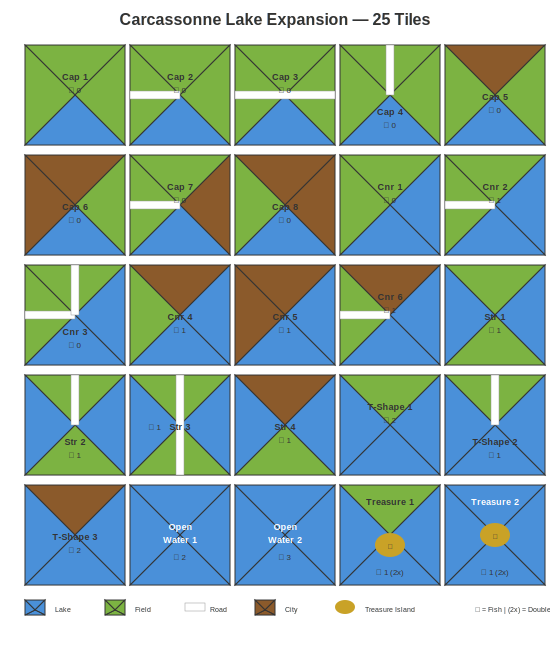

# Carcassonne: Lake Expansion

A fan-made expansion for Carcassonne introducing **lakes** as a new edge type.



---

## Overview

Lakes work like cities: lake edges must connect to other lake edges, and a lake scores when fully enclosed. But beware—incomplete lakes score **zero points**.

**New meeple:** Fisherman (works like a knight in a city)

---

## Scoring

| Condition | Points |
|-----------|--------|
| Completed lake | 2 per tile + 1 per fish |
| Incomplete lake | 0 |
| Treasure Island bonus | Double total score |

### Examples

| Lake | Tiles | Fish | Score |
|------|-------|------|-------|
| Small | 3 | 2 | 8 |
| Medium | 5 | 4 | 14 |
| Large | 8 | 9 | 25 |
| Large + Treasure Island | 8 | 9 | 50 |

---

## Components

**25 tiles** featuring lake edges combined with roads, cities, and fields:

- 8 Caps (1 lake edge)
- 6 Corners (2 adjacent lake edges)
- 4 Straights (2 opposite lake edges)
- 3 T-Shapes (3 lake edges)
- 2 Open Water (4 lake edges)
- 2 Treasure Islands (3-4 lake edges, doubles score)

**20 fish** distributed across tiles (more fish on riskier tiles)

---

## Documentation

- [Full Rules](docs/rules.md) — Complete rules and tile specifications
- [Development Plan](docs/development-plan.md) — Step-by-step guide to make this expansion

---

## Quick Rules

1. **Place tile:** Lake edges must connect to lake edges
2. **Place fisherman:** Claim an unoccupied lake (optional)
3. **Score:** When a lake is fully enclosed, score 2 points per tile + 1 per fish
4. **Treasure Island:** If present, double the total score
5. **Incomplete lakes:** Score nothing at game end

---

## Files

```
carcassonne-lake-expansion/
├── README.md
├── LICENSE
├── docs/
│   ├── rules.md
│   └── development-plan.md
└── assets/
    └── tile-grid.svg
```

---

## Status

🎲 **Concept phase** — Ready for prototyping and playtesting


---

## Disclaimer

This is a fan-made expansion. Carcassonne is a trademark of Hans im Glück. This project is not affiliated with or endorsed by Hans im Glück or Z-Man Games.
